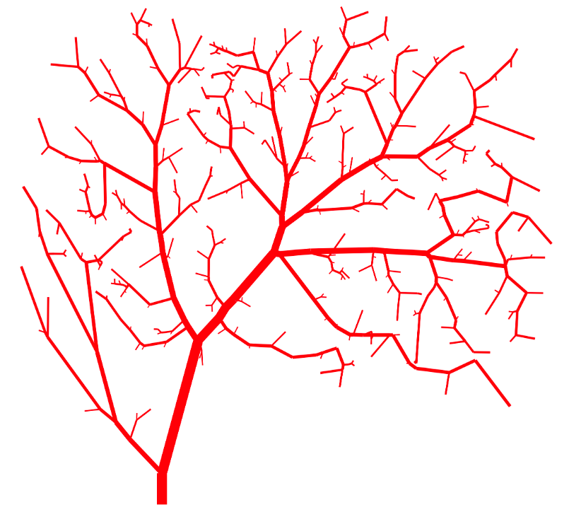

# Solving network models in FEniCS

This repo contains the code used for the paper *Network models for pulsatile fluid flow in open or porous perivascular spaces* (in preparation) by Ingeborg Gjerde, Marie Rognes and Barbara Wohlmuth.

The model implementation is based on `graphnics` and [`fenics_ii`](https://github.com/MiroK/fenics_ii). The `graphnics` library combines `networkx` and `fenics_ii` and can be used to solve network flow models using the finite element method. The `grapnics` library has been moved to a [separate repo](https://github.com/IngeborgGjerde/graphnics).
 
)

The manuscript corresponding to this repo will appear in the not-so-distant future. Feel free to contact me if you would like to read the manuscript. 
